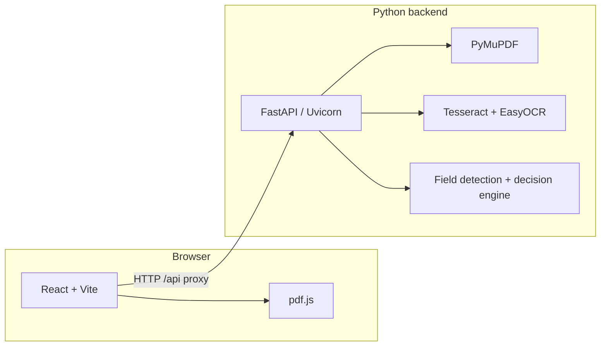

# Smart Find Navigator — Technology Stack

This document explains **what** technologies the project uses, **why** they were chosen, and **when** they come into play. It covers both **backend** (`backend/`) and **frontend** (`frontend/`) so newcomers can understand the system without reading every source file first.

---

## 1. High-level architecture

| Layer | Role |
|-------|------|
| **Frontend** | Browser UI: upload PDFs, show pages, highlight detected fields, search text, call the API. |
| **Backend** | HTTP API: parse PDFs, run OCR / extraction, store session state, decide “next field,” optional AI. |
| **External tools** | **Tesseract** (separate install): OCR engine invoked from Python for scanned pages. |

---

## 2. Backend (Python)

**Runtime:** Python **3.10+** (virtual environment recommended; see `backend/requirements.txt`).

### 2.1 Core framework & server

| Technology | What it is | Why we use it | When it runs |
|------------|------------|---------------|--------------|
| **FastAPI** | Modern async-capable web framework for building APIs with automatic OpenAPI (`/docs`) docs. | Fast to develop, clear request/validation models (`Pydantic`), good for JSON + file uploads. | Every HTTP request to the API. |
| **Uvicorn** (`uvicorn[standard]`) | ASGI server that runs the FastAPI app. | Production-style dev server with reload, WebSockets support if needed later. | Whenever you start the API (`run-api.bat` or `python -m uvicorn main:app …`). |
| **python-multipart** | Parses `multipart/form-data` (file uploads). | PDF uploads use `multipart`; FastAPI needs this for `UploadFile`. | `POST /upload-pdf` and similar endpoints. |
| **Pydantic** (via FastAPI) | Data validation and settings models. | Validates JSON bodies and query params; fewer bugs at the boundary. | Request/response models in `main.py` and related modules. |

### 2.2 PDF & document processing

| Technology | What it is | Why we use it | When it runs |
|------------|------------|---------------|--------------|
| **PyMuPDF** (`pymupdf`, import name `fitz`) | Library to open PDFs, read text, render pages to images, get bounding boxes. | Fast native PDF handling; digital text extraction + rasterization for OCR on weak/scanned pages. | Ingestion and field pipeline (`pdf_processor.py`, `ai_field_extractor.py`). |
| **Pillow** (`PIL`) | Image manipulation in Python. | Prepare page images for OCR/ML (resize, mode conversion). | Before Tesseract/EasyOCR/Donut image inputs. |

### 2.3 OCR & text from scans

| Technology | What it is | Why we use it | When it runs |
|------------|------------|---------------|--------------|
| **Tesseract** (system install, not pip) | Classic open-source OCR engine. | Strong baseline for printed text; widely deployed; `pytesseract` is a thin wrapper. | Pages with little or no extractable text, when **aggressive OCR** is on (default for scans). Configure path via `TESSERACT_CMD` / `run-api.bat`. |
| **pytesseract** | Python bindings to call the Tesseract binary. | Integrates Tesseract into the pipeline without shell scripting. | Same as Tesseract usage above. |
| **EasyOCR** | Deep-learning OCR (PyTorch under the hood). | Often better than Tesseract alone on **handwriting** and messy scans; complements Tesseract. | Aggressive / weak-page OCR paths; first run may download model weights. |

### 2.4 Matching & numeric utilities

| Technology | What it is | Why we use it | When it runs |
|------------|------------|---------------|--------------|
| **RapidFuzz** | Fast fuzzy string matching. | Tolerates small OCR/spelling differences when linking labels to values or validating concepts. | Field detection, verification, and search-related logic where approximate match helps. |
| **NumPy** | Numerical arrays (dependency of EasyOCR/scipy stack). | Required by OCR/ML stacks and some geometry/array work. | Indirectly through EasyOCR; any numeric preprocessing if used. |

### 2.5 Optional cloud AI

| Technology | What it is | Why we use it | When it runs |
|------------|------------|---------------|--------------|
| **OpenAI Python SDK** (`openai`) | Official client for OpenAI APIs. | Optional **GPT** extraction/validation when `OPENAI_API_KEY` is set and the upload/API enables OpenAI. | `gpt_validator.py` / merge paths in `ai_field_extractor.py` — **only if configured**. |

### 2.6 Optional local ML (Donut)

**Installed separately:** `backend/requirements-ml.txt` (large: **PyTorch**, **transformers**, etc.).

| Technology | What it is | Why we use it | When it runs |
|------------|------------|---------------|--------------|
| **PyTorch** | Deep learning runtime. | Powers EasyOCR (already in base `requirements.txt`) and optional Donut. | EasyOCR always; Donut only with ML extras. |
| **Hugging Face Transformers** | Pre-trained model loading (Donut DocVQA). | Answers a few **document VQA** questions on page 1 image to merge hints with classical fields. | Only when transformers are installed **and** env/upload enables Donut (`SMART_FIND_TRANSFORMERS`, etc.). |
| **Accelerate**, **SentencePiece** | Training/inference helpers and tokenization for some models. | Donut/transformers ecosystem dependencies. | With `requirements-ml.txt` install. |

### 2.7 Backend modules (conceptual map)

| Module | Purpose |
|--------|---------|
| `main.py` | FastAPI app, routes, in-memory session (multi-PDF), CORS, upload orchestration. |
| `pdf_processor.py` | PDF → text blocks, layout, OCR triggers. |
| `ai_field_extractor.py` | Orchestrates classical + optional GPT + optional Donut merges. |
| `decision_engine.py` | Priorities, sections, “next field,” reading order. |
| `document_search.py` | Search across OCR blocks in session PDFs. |
| `readable_text.py` | Human-readable transcript from blocks for the UI. |
| `batch_field_verify.py` | Optional batch verification against user “concepts” (API-driven). |
| `gpt_validator.py` | OpenAI-based extract/validate helpers. |
| `session_email.py` | Email/share flows (configurable; can be dummy in dev). |

---

## 3. Frontend (JavaScript / React)

**Runtime:** **Node.js 18+** for tooling; the app runs in the **browser**.

### 3.1 UI framework & tooling

| Technology | What it is | Why we use it | When it runs |
|------------|------------|---------------|--------------|
| **React 18** | Component-based UI library. | Manage state for uploads, field navigation, PDF viewer, modals, and API feedback. | Entire SPA (`App.jsx`, components). |
| **React DOM** | Renders React to the browser DOM. | Standard React web target. | Same as above. |
| **Vite 5** | Dev server + production bundler (Rollup-based). | Very fast HMR during development; simple config; modern ESM. | `npm run dev`, `npm run build`, `npm run preview`. |
| **@vitejs/plugin-react** | Enables Fast Refresh for React in Vite. | Smooth developer experience. | Dev and build only (not shipped as app logic). |

### 3.2 HTTP & PDF in the browser

| Technology | What it is | Why we use it | When it runs |
|------------|------------|---------------|--------------|
| **Axios** | HTTP client (promises, interceptors). | JSON calls to the backend with a shared `baseURL`; consistent error handling. | Most API calls from `api.js`. |
| **Native `fetch`** | Browser HTTP API. | Used for **multipart uploads** so the browser sets the correct `multipart` boundary (see `api.js` comments). | PDF upload requests. |
| **pdf.js** (`pdfjs-dist`) | Mozilla’s PDF renderer (canvas + text layer). | Display PDF pages in the browser without a plugin; get text positions for search/highlight. | `PDFViewer.jsx` (+ worker `pdf.worker.min.mjs`). |

### 3.3 Custom UI pieces

| Piece | Role |
|-------|------|
| `HighlightOverlay.jsx` | Draws highlights over the PDF for the active field or search hit. |
| `pdfTextSearch.js` | Client-side text search helpers on PDF text content. |
| `api.js` | Central place for base URL, proxy vs production URL, and endpoint wrappers. |

### 3.4 How the frontend reaches the backend

| Mode | Behavior |
|------|----------|
| **Development** | Vite **proxies** `/api` → `http://127.0.0.1:<backendPort>` (default **8000**). The app uses same-origin `/api` to reduce CORS issues. Port is configurable via `VITE_BACKEND_PORT` / `SMART_FIND_API_PORT`. |
| **Production build** | Defaults to `http://127.0.0.1:8000` unless **`VITE_API_URL`** is set to your real API URL. |

---

## 4. External / system dependencies (not in `package.json` alone)

| Item | Needed for | Notes |
|------|------------|--------|
| **Python 3.10+** | Backend | Create `backend/.venv` and `pip install -r requirements.txt`. |
| **Node.js 18+** | Frontend build & dev | `npm install` in `frontend/`. |
| **Tesseract OCR** | Scanned PDFs | Install separately; see README / `install-tesseract-windows.ps1`. Verify with `GET /health/ocr`. |

---

## 5. Typical request flows (when stacks touch each other)

1. **Upload PDF**  
   Browser → `fetch` multipart → FastAPI → PyMuPDF (+ Tesseract/EasyOCR if needed) → field list JSON → React updates state and shows PDF via pdf.js.

2. **Next field / complete field**  
   React → Axios → FastAPI → `decision_engine` updates session → JSON with bbox/page → pdf.js view + `HighlightOverlay`.

3. **Search in document**  
   Can involve client pdf.js text search and/or server `document_search` over stored OCR blocks for multi-PDF session search (see API and `App.jsx` behavior).

4. **Optional GPT**  
   Only when API key and server/upload flags enable OpenAI — does **not** replace OCR for full scans; it augments structuring/validation.

5. **Optional Donut**  
   Only with `requirements-ml.txt` and env/upload enabling transformers — heavy; GPU recommended.

---

## 6. Summary table — “at a glance”

| Area | Main technologies |
|------|-------------------|
| **API layer** | FastAPI, Uvicorn, Pydantic, Starlette (via FastAPI) |
| **PDF & OCR** | PyMuPDF, Tesseract + pytesseract, EasyOCR, Pillow |
| **Matching / math** | RapidFuzz, NumPy |
| **Optional AI** | OpenAI SDK; PyTorch + Transformers (Donut) via `requirements-ml.txt` |
| **Frontend** | React 18, Vite 5, Axios, pdf.js |
| **Integration** | Vite dev proxy (`/api`), CORS on FastAPI, env vars for ports and keys |

---

## 7. Further reading

- **Run & configure:** root `README.md` (ports, env vars, OCR tuning).
- **API contracts:** `http://127.0.0.1:8000/docs` when the backend is running.
- **Dependencies (exact versions):** `backend/requirements.txt`, `backend/requirements-ml.txt`, `frontend/package.json`.

---

*This file describes the Smart Find / Smart PDF Navigator project as of the repository layout under `backend/` and `frontend/`.*
